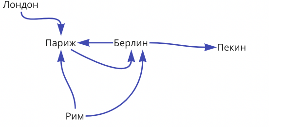
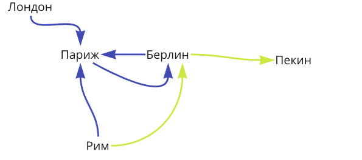

### "Ориентированные графы"

Информацию о наличии прямых авиарейсов между городами можно представить в виде ориентированного графа. Вершинами в нём будут города, дугами - наличие прямого рейса.

Например, рассмотрим следующий граф:

В нём отображается наличие прямого рейса из Рима в Берлин, но не из Парижа в Лондон или из Парижа в Пекин.

Вашей задачей будет написать метод, который определяет за какое минимальное количество перелётов человек может добраться из одного города в другой. Если добраться невозможно, то метод должен вернуть -1.

Например, из Рима до Пекина можно добраться за 2 перелёта (алгоритм не должен выбрать более длинный путь Рим - Париж - Берлин - Пекин):

**Алгоритм**
Для этого достаточно запустить поиск в ширину из стартовой вершины. Порядок обхода такой, что мы 
гарантированно обходим вершины по возрастанию их расстояния от исходной вершины (в отличие от обхода в 
глубину).

Во время обхода будем запоминать расстояния до каждой вершины в мапе, чтобы была информация для ответа.

Как только посещаем вершину города-назначения, возвращаем результат из мапы.